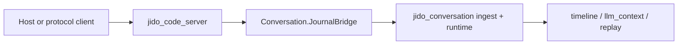
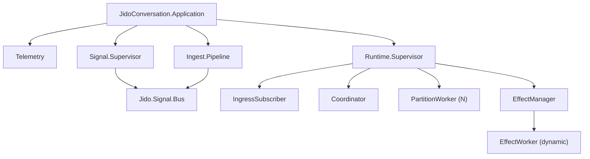
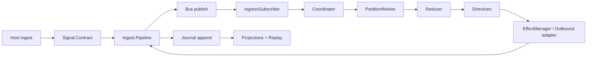

# 01. System Architecture

This guide describes the runtime shape of `jido_conversation` and how core
modules collaborate.

## Cross-Repo Ownership Boundary

`jido_conversation` is the conversation substrate. It owns:

- canonical contract validation and journal-first ingest
- deterministic reducer/scheduler runtime
- effect lifecycle eventing
- projection and replay APIs

`jido_conversation` does not own business orchestration policy such as mode
pipelines, strategy selection, or project tool declaration. Those live in
`jido_code_server` and are expressed into this library as canonical
conversation events.

## Application boot graph

`JidoConversation.Application` starts four top-level subsystems:

- `JidoConversation.Telemetry`
- `JidoConversation.Signal.Supervisor`
- `JidoConversation.Ingest.Pipeline`
- `JidoConversation.Runtime.Supervisor`

## End-to-end event path

## Architectural intent

- Keep reducer logic pure and deterministic.
- Route all side effects through runtime directives.
- Preserve journal-first ingestion as the durable source of truth.
- Expose only stable public APIs through `JidoConversation`.

## Public API surface

- `JidoConversation.ingest/2`
- `JidoConversation.timeline/2`
- `JidoConversation.llm_context/2`
- `JidoConversation.health/0`
- `JidoConversation.telemetry_snapshot/0`
