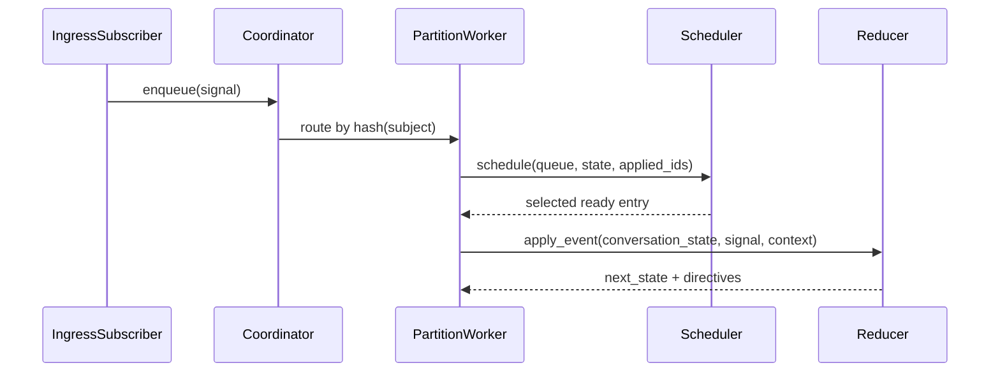

# 04. Runtime Coordinator, Scheduler, and Reducer

This guide explains deterministic runtime processing after ingestion.

## Core modules

- `Runtime.IngressSubscriber`
- `Runtime.Coordinator`
- `Runtime.PartitionWorker`
- `Runtime.Scheduler`
- `Runtime.Reducer`

## Processing sequence

## Partition model

- Conversation `subject` determines partition assignment.
- Each partition keeps isolated queue/scheduler/conversation state.
- This preserves conversation locality while allowing concurrent partitions.

## Reducer contract

`Reducer.apply_event/3` returns:

- updated conversation state
- directives for side effects (`:emit_applied_marker`, `:start_effect`,
  `:cancel_effects`, `:emit_output`)

Reducer never performs direct side effects.

## Scheduler behavior

`Runtime.Scheduler` resolves ready events with deterministic ordering rules
(causality + fairness + priority). The order can differ from append order while
remaining reproducible under replay.

## Applied markers

For non-`conv.applied.*` events, runtime emits an applied marker directive to
record reducer application lineage and scheduling context.
