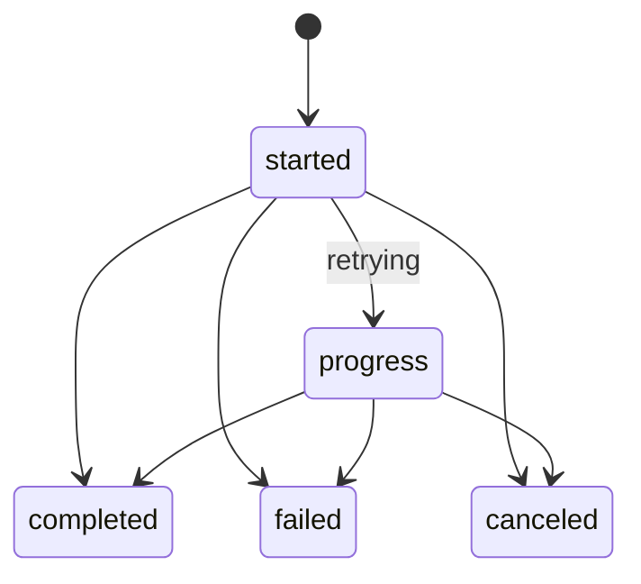

# 05. Effect Runtime and Cancellation

Effects are executed asynchronously and reported through lifecycle signals.

## Core modules

- `Runtime.EffectManager`
- `Runtime.EffectWorker`

## Effect manager responsibilities

- start workers from reducer directives
- track in-flight effects by effect ID and conversation
- route cancellation requests to all effect workers for a conversation
- emit start-failure lifecycle fallback when worker boot fails

## Effect worker lifecycle

`EffectWorker` handles:

- attempt execution
- timeout handling
- retry/backoff policy
- backend cancellation
- lifecycle emission (`started`, `progress`, `completed`, `failed`, `canceled`)

## Retry semantics

- Retry policy comes from merged class defaults + directive overrides.
- Retryable reasons emit `progress` with `status: "retrying"`.
- LLM retries include normalized `error_category` in retrying payloads.

## Cancellation semantics

- Conversation cancel directives call `EffectManager.cancel_conversation/3`.
- Worker attempts backend-specific cancellation when available.
- Cancellation telemetry records backend cancel result and latency.

## Effect classes

Supported classes:

- `:llm`
- `:tool`
- `:timer`
