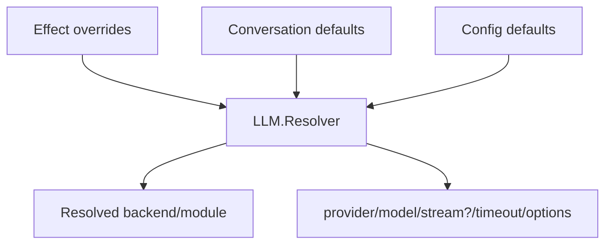

# 06. LLM Subsystem and Adapter Contract

The LLM subsystem provides a backend-agnostic runtime API with pluggable
adapters.

## Core modules

- `LLM.Request`
- `LLM.Result`
- `LLM.Event`
- `LLM.Error`
- `LLM.Backend` behavior
- `LLM.Resolver`
- `LLM.Adapters.JidoAI`
- `LLM.Adapters.Harness`

## Resolution flow

Resolution precedence:

1. effect overrides
2. conversation defaults
3. app config defaults

## Backend contract

`LLM.Backend` modules implement start/stream/cancel behavior through normalized
request/result/event/error types.

## Error normalization

Adapters normalize provider/runtime failures into categories used by runtime and
telemetry, including:

- `provider`
- `timeout`
- `transport`
- `auth`
- `config`
- `canceled`
- `unknown`

## Runtime integration

- Partition worker starts LLM effects through effect directives.
- Effect worker emits `conv.effect.llm.generation.*` lifecycle events.
- Reducer-derived output directives project user-facing assistant/tool output.

## Adapter-specific notes

- `JidoAI` adapter: provider/model routing is configured in this library.
- `Harness` adapter: provider/model selection is usually delegated to harness
  runtime/tooling.
