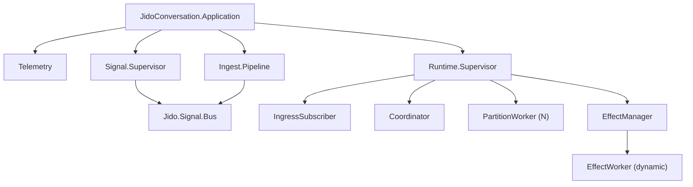

# Component Map

This map summarizes major runtime components and the boundaries between them.

## Top-level dependency graph

## Component table

| Component | Primary modules | Responsibility | Key outputs |
| --- | --- | --- | --- |
| Public API facade | `JidoConversation` | Stable app-facing entry points | Ingest/projection/health/telemetry APIs |
| Contract boundary | `JidoConversation.Signal.Contract` | Normalize + validate envelope, namespace, version, payload requirements | Canonical validated signals or rejection errors |
| Signal infra | `JidoConversation.Signal.Supervisor`, `Jido.Signal.Bus` | Bus startup/routing/replay plumbing | Published signals, replay access |
| Ingestion | `JidoConversation.Ingest.Pipeline` | Journal-first ingest with dedupe and optional `cause_id` linkage | Journaled + published events |
| Runtime ingress | `JidoConversation.Runtime.IngressSubscriber` | Persistent bus subscription, contract re-check, routing to runtime | Enqueued runtime events |
| Partition routing | `JidoConversation.Runtime.Coordinator` | Hash-by-subject partition assignment | Partition worker enqueue calls |
| Deterministic scheduler | `JidoConversation.Runtime.Scheduler` | Priority + causality + fairness event selection | Next ready queue entry |
| Pure reducer | `JidoConversation.Runtime.Reducer` | Conversation state transitions and directive emission | Updated state + directives |
| Directive executor | `JidoConversation.Runtime.PartitionWorker` | Applies reducer output, executes directives, emits telemetry | Applied markers, effect starts/cancels, outputs |
| Effect orchestration | `JidoConversation.Runtime.EffectManager`, `JidoConversation.Runtime.EffectWorker` | In-flight worker lifecycle, retries, timeout, cancellation | `conv.effect.*` lifecycle events |
| Projection layer | `JidoConversation.Projections.*` | Materialized timeline and LLM context views from events | User/UI and model context views |
| Runtime metrics | `JidoConversation.Telemetry` | Aggregates telemetry events for host polling | `telemetry_snapshot/0` metrics |

## Boundary rules

- `Reducer` must stay pure.
- `PartitionWorker` is the only place reducer directives are executed.
- `Ingest.Pipeline` is the only write boundary to journal + bus for normal event entry.
- Mode/strategy/tool business orchestration is host-owned (for example,
  `jido_code_server`) and should not be implemented in this library.
- Host app should depend on `JidoConversation` public APIs, not deep internals.
