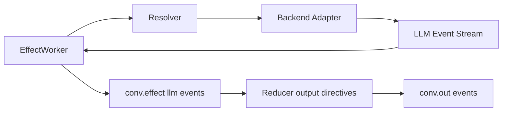

# LLM Backend Adapter Contract

This guide documents the adapter contract used by the runtime LLM effect path.

## Purpose

`jido_conversation` runs all LLM work through `Jido.Conversation.LLM.Backend`.
Adapters hide provider-specific details while exposing normalized request,
stream, error, and cancellation semantics.

Core modules:

- `Jido.Conversation.LLM.Backend`
- `Jido.Conversation.LLM.Request`
- `Jido.Conversation.LLM.Event`
- `Jido.Conversation.LLM.Result`
- `Jido.Conversation.LLM.Error`
- `Jido.Conversation.Runtime.EffectWorker`

## Runtime flow

## Behaviour contract

Defined in `Jido.Conversation.LLM.Backend`:

- `capabilities/0`
- `start/2`
- `stream/3`
- `cancel/2`

Return contracts:

- `start/2` and `stream/3` return:
  - `{:ok, %Result{}}`
  - `{:ok, %Result{}, execution_ref}`
  - `{:error, %Error{}}`
- `cancel/2` returns:
  - `:ok`
  - `{:error, %Error{}}`

## Event normalization contract

Stream callbacks must emit `Jido.Conversation.LLM.Event` lifecycles:

- `:started`
- `:delta`
- `:thinking`
- `:completed`
- `:failed`
- `:canceled`

`EffectWorker` maps these to runtime lifecycle signals:

- stream `:delta` -> `conv.effect.llm.generation.progress` with `token_delta`
- stream `:thinking` -> `conv.effect.llm.generation.progress` with
  `thinking_delta`
- final result -> `conv.effect.llm.generation.completed`
- failure -> `conv.effect.llm.generation.failed`
- cancel -> `conv.effect.llm.generation.canceled`

Canonical chunk representation:

- reasoning/thinking chunks use lifecycle `:thinking` with chunk text in
  `LLM.Event.content`
- response text chunks use lifecycle `:delta` with chunk text in
  `LLM.Event.delta`

Minimum attribution metadata:

- adapters should include `backend`, `provider`, and `model` whenever known
- `:started` and terminal events should always include known attribution fields
- `:delta`/`:thinking` events should include attribution when available without
  adding backend-native coupling

## Error taxonomy

Adapters should normalize provider-native failures to `Jido.Conversation.LLM.Error`
categories:

- `:config`
- `:auth`
- `:timeout`
- `:provider`
- `:transport`
- `:canceled`
- `:unknown`

Set `retryable?` accurately because runtime retry policy depends on it.

Built-in adapter HTTP retryability policy:

- `401`, `403` -> category `:auth`, `retryable?: false`
- `408` -> category `:timeout`, `retryable?: true`
- `409`, `425`, `429`, and `5xx` -> category `:provider`, `retryable?: true`
- other `4xx` -> category `:provider`, `retryable?: false`

## Cancellation contract

- Adapters should expose a stable `execution_ref` when possible.
- `EffectWorker` stores execution refs from:
  - callback event metadata
  - adapter tuple return (`{:ok, result, execution_ref}`)
- On cancel, runtime calls adapter `cancel/2` and records cancellation outcome
  in lifecycle and telemetry metadata.

## Adapter checklist

1. Implement `Jido.Conversation.LLM.Backend`.
2. Normalize inbound request options and provider/model inputs.
3. Emit valid `LLM.Event` structs for streaming lifecycles.
4. Return `LLM.Result` structs for terminal outcomes.
5. Normalize all failures to `LLM.Error`.
6. Support `cancel/2` when backend can cancel active executions.
7. Add adapter tests for:
   - happy path
   - failure normalization
   - cancellation behavior
   - lifecycle emission ordering

See existing adapter tests:

- `test/jido_conversation/llm/adapters/jido_ai_test.exs`
- `test/jido_conversation/llm/adapters/harness_test.exs`
