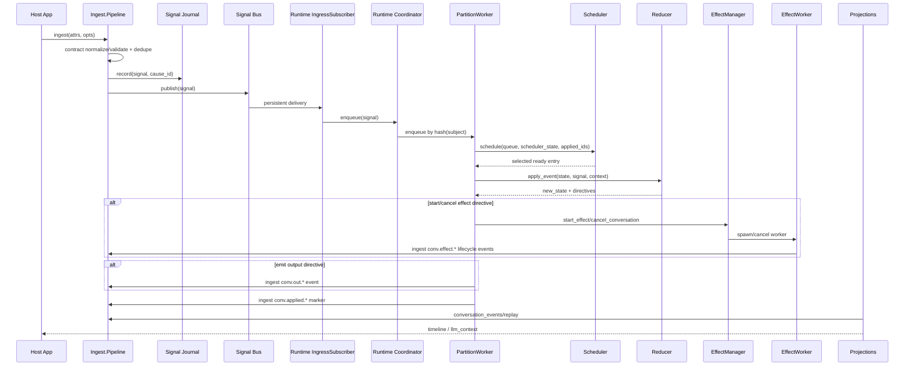

# Runtime Execution Flow

This sequence describes what happens from ingress to projections.

## End-to-end sequence

## Ordering model

- Record order:
  - preserved by journal append sequence
- Processing order:
  - chosen by scheduler based on causal readiness, priority, and fairness

This split is intentional and tested for determinism/replay parity.

## Partition model

- `subject` hashes to a partition id.
- Each partition has:
  - its own queue
  - scheduler state
  - conversation state map
  - applied signal-id set

This gives per-conversation locality while supporting horizontal scaling.

## Directive model

Reducer directives currently include:

- `:emit_applied_marker`
- `:start_effect`
- `:cancel_effects`
- `:emit_output`

Directive execution happens in `PartitionWorker`, not in `Reducer`.
