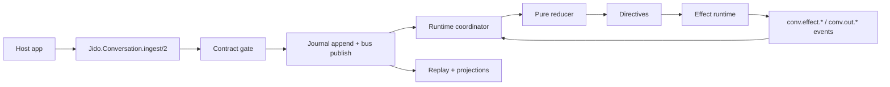

# 01. Overview and Architecture

`jido_conversation` is an embeddable, event-driven runtime for conversation
workflows. Your host application publishes conversation events, and the runtime
handles deterministic state transitions, effect execution, and projection
queries.

## What this library gives you

- Journal-first event ingestion with contract validation
- Deterministic scheduler and pure reducer flow
- Runtime effect handling for `:llm`, `:tool`, and `:timer`
- Projection APIs for UI timeline and LLM context
- Runtime health and telemetry snapshots

## Core public APIs

- `Jido.Conversation.ingest/2`
- `Jido.Conversation.timeline/2`
- `Jido.Conversation.llm_context/2`
- `Jido.Conversation.health/0`
- `Jido.Conversation.telemetry_snapshot/0`

## Signal families

- `conv.in.*`: inbound user/control/timer signals
- `conv.applied.*`: reducer application markers
- `conv.effect.*`: effect lifecycle events
- `conv.out.*`: outbound UI-facing conversation output
- `conv.audit.*`: audit and trace events

## Runtime component map

1. Contract normalization (`Jido.Conversation.Signal.Contract`)
2. Journal + bus ingestion (`Jido.Conversation.Ingest.Pipeline`)
3. Partition scheduling + reducer apply (`Jido.Conversation.Runtime.Coordinator` + `Jido.Conversation.Runtime.Reducer`)
4. Effect execution (`Jido.Conversation.Runtime.EffectManager` + `Jido.Conversation.Runtime.EffectWorker`)
5. Projection reads (`Jido.Conversation.Projections`)

## Conversation identity

Use one stable `conversation_id` per conversation thread. It is carried in the
signal `subject`, and it is the partition key for scheduling, replay, and
projection queries.
