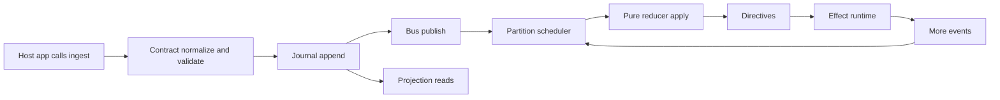

# How It Works

`jido_conversation` is an embeddable event-driven conversation runtime.

At a high level:

- Host app ingests events into the runtime
- Events pass the contract boundary
- Events are written to the journal and published to the bus
- Runtime scheduler and reducer apply events deterministically per conversation
- Effects emit follow-up lifecycle events
- Projections build timeline and LLM context views

## Core concepts

### Conversation identity

- `conversation_id` is carried by signal `subject`.
- All per-conversation partitioning, replay, and projections use this value.

### Stream namespaces

- `conv.in.*` incoming/control/timer events
- `conv.applied.*` reducer-application markers
- `conv.effect.*` effect lifecycle events
- `conv.out.*` user-facing output events
- `conv.audit.*` audit/trace events

### Contract boundary

Every signal must satisfy:

- required envelope fields (`type`, `source`, `id`, `subject`)
- supported namespace prefix
- supported contract version (`extensions.contract_major`, currently `1`)
- required payload keys per stream family

### Determinism model

- Journal order is durable record order.
- Runtime processing can prioritize events (for responsiveness), but scheduler
  rules are deterministic.
- Reducer logic is pure: state transitions are separate from side effects.
- Replay and parity tests verify reproducibility of outcomes.

## Public entry points

- `JidoConversation.ingest/2`
- `JidoConversation.timeline/2`
- `JidoConversation.llm_context/2`
- `JidoConversation.health/0`
- `JidoConversation.start_conversation/1`
- `JidoConversation.ensure_conversation/1`
- `JidoConversation.send_user_message/3`
- `JidoConversation.record_assistant_message/3`
- `JidoConversation.configure_llm/3`
- `JidoConversation.configure_skills/2`
- `JidoConversation.generate_assistant_reply/2`
- `JidoConversation.await_generation/3`
- `JidoConversation.send_and_generate/3`
- `JidoConversation.cancel_generation/2`
- `JidoConversation.derived_state/1`
- `JidoConversation.conversation_timeline/1`
- `JidoConversation.conversation_llm_context/2`
- `JidoConversation.telemetry_snapshot/0`
